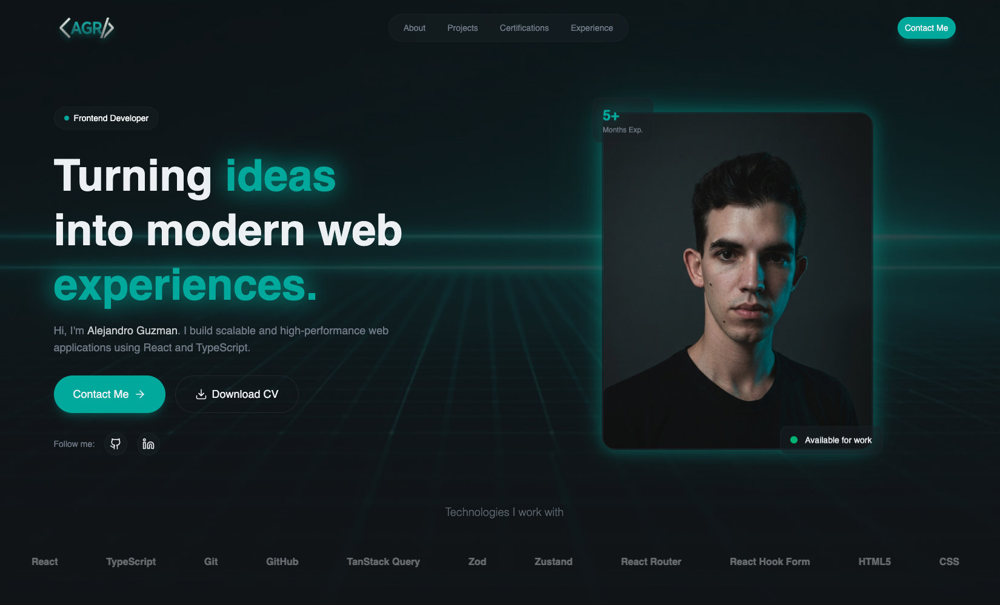

# 💼 Portfolio - Alejandro Guzmán


Portafolio personal profesional de **Alejandro Guzmán Rodríguez**, Desarrollador Frontend. Un sitio web moderno, responsivo y animado que presenta su experiencia, proyectos y habilidades técnicas.

Construido con **React**, **TypeScript** y **Tailwind CSS**, el portafolio destaca por sus animaciones fluidas con **GSAP**, efectos de glassmorphism y un diseño limpio y profesional orientado a recruiters y clientes potenciales.

---

## 🌍 Live Demo

👉 Visita el sitio en vivo: **[https://alejandro-gr01.github.io/portfolio/](https://alejandro-gr01.github.io/portfolio/)**

---

## 📸 Preview



---

## 🚀 Descripción

Portafolio profesional minimalista que showcasea:

- Experiencia como Desarrollador Frontend
- Proyectos destacados con enlaces funcionales
- Habilidades técnicas y herramientas
- Formulario de contacto funcional con EmailJS
- Animaciones suaves con GSAP ScrollTrigger
- Diseño completamente responsivo

---

## ✨ Características Principales

| Feature | Descripción |
|----------|-------------|
| 🎨 Glassmorphism UI | Efectos de vidrio con gradientes y blur |
| 🎬 GSAP Animations | Animaciones ScrollTrigger en secciones |
| 📧 Contact Form | Formulario funcional con EmailJS |
| 📱 Fully Responsive | Mobile-first design |
| 🖥️ Hero Section | Presentación con foto de perfil y badges |
| 💼 Projects | Cards de proyectos con tags y enlaces |
| 📜 Experience | Timeline profesional de experiencia |
| 🏆 Certifications | Sección de certificaciones |

---

## 🛠️ Stack Tecnológico

- **React 19**
- **TypeScript 5.9**
- **Vite 7**
- **Tailwind CSS 4**
- **GSAP 3 (ScrollTrigger)**
- **@gsap/react**
- **React Hook Form**
- **Sonner** (Notificaciones toast)
- **Lucide React** (Iconos)
- **@emailjs/browser** (Formulario de contacto)

---

## 📦 Instalación

```bash
# Clonar repositorio
git clone https://github.com/tuusuario/portfolio.git

# Entrar al proyecto
cd portfolio

# Instalar dependencias
pnpm install

# Ejecutar entorno desarrollo
pnpm dev

# Build producción
pnpm build

# Preview producción
pnpm preview
```

---

## ⚙️ Variables de Entorno

Crea un archivo `.env.local` con tus credenciales de EmailJS:

```env
VITE_EMAILJS_SERVICE_ID=tu_service_id
VITE_EMAILJS_TEMPLATE_ID=tu_template_id
VITE_EMAILJS_PUBLIC_KEY=tu_public_key
```

---

## 📂 Estructura del Proyecto

```
src/
├── components/
│   ├── AnimatedBorderAnchor.tsx
│   ├── AnimatedBorderButton.tsx
│   ├── Button.tsx
│   ├── ButtonAnchor.tsx
│   ├── ErrorMessage.tsx
│   └── TagLabel.tsx
├── constants/
│   └── index.ts          # Datos estáticos (proyectos, skills, experiencia)
├── layouts/
│   ├── Footer.tsx
│   └── Navbar.tsx
├── sections/
│   ├── About.tsx
│   ├── Certifications.tsx
│   ├── Contact.tsx
│   ├── Experience.tsx
│   ├── Hero.tsx
│   └── Projects.tsx
│   
├── types/
│   └── index.ts          # Interfaces TypeScript
├── App.tsx
├── main.tsx
└── index.css
```

---

## 📱 Responsive Design

Optimizado para:

- 📱 Mobile (320px+)
- 📲 Tablet (768px+)
- 💻 Desktop (1024px+)
- 🖥 Large screens (1440px+)

---

## 🎨 Características del Diseño

- **Dark Theme** con accent en cyan (#20B2A6)
- **Glassmorphism** en cards y elementos flotantes
- **Marquee animation** para habilidades técnicas
- **Scroll-triggered animations** con GSAP
- **Smooth transitions** en todos los elementos interactivos

---

## 📬 Configuración del Formulario de Contacto

El formulario utiliza **EmailJS** para enviar mensajes. Para activarlo:

1. Crea una cuenta en [EmailJS](https://www.emailjs.com/)
2. Crea un servicio de email (Gmail, Outlook, etc.)
3. Crea una plantilla de email
4. Obtén tu Public Key
5. Configura las variables de entorno

---

## 🔮 Roadmap

- [ ] Agregar más proyectos reales
- [ ] Integrar blog técnico
- [ ] Modo claro/oscuro
- [ ] Animaciones 3D con Three.js
- [ ] Optimización SEO
- [ ] Tests automatizados

---

## 📄 Licencia

Este proyecto está bajo la licencia MIT.

---

## 👨‍💻 Autor

**Alejandro Guzmán Rodríguez**

Frontend Developer | React Enthusiast | Performance Focused

- 📧 Email: alejandrogr01dev@gmail.com
- 📍 Location: La Palma, Pinar del Río, Cuba
- 🔗 LinkedIn: https://www.linkedin.com/in/alejandro-guzm%C3%A1n-rodr%C3%ADguez-3985b23b3?utm_source=share&utm_campaign=share_via&utm_content=profile&utm_medium=android_app
- 🐙 GitHub: https://github.com/Alejandro-GR01

---

⭐ Si te gustó el proyecto, no olvides darle una estrella.
